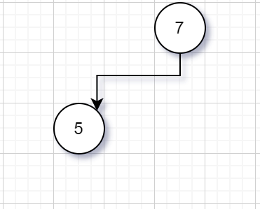
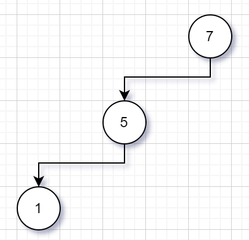
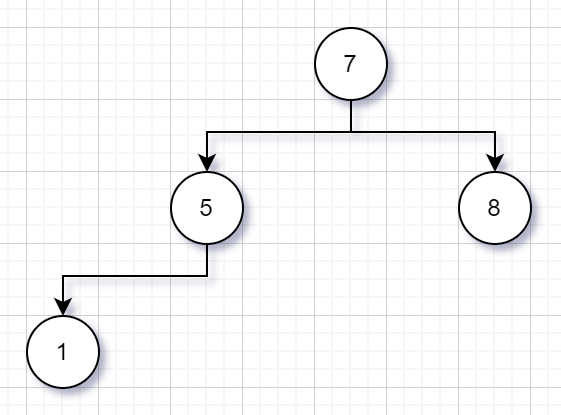
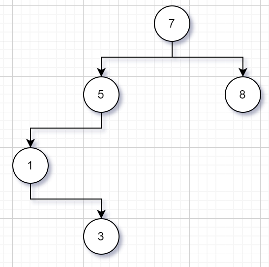
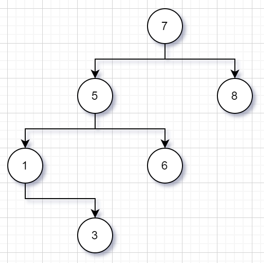
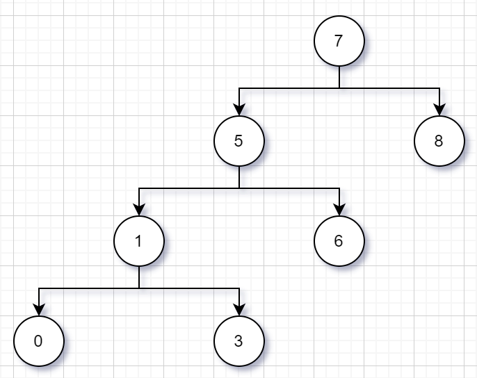
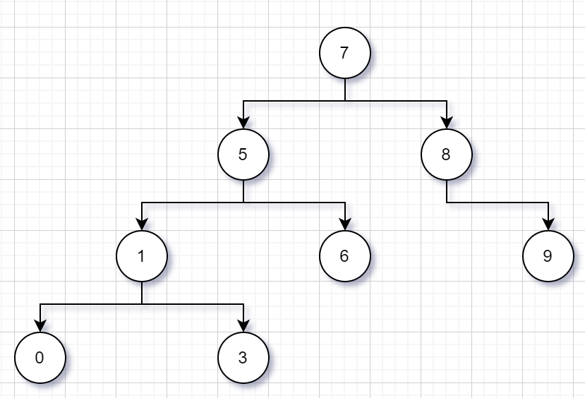
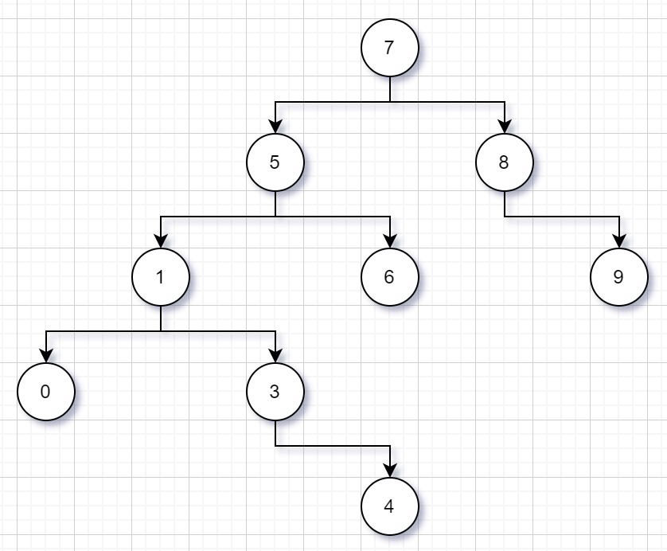
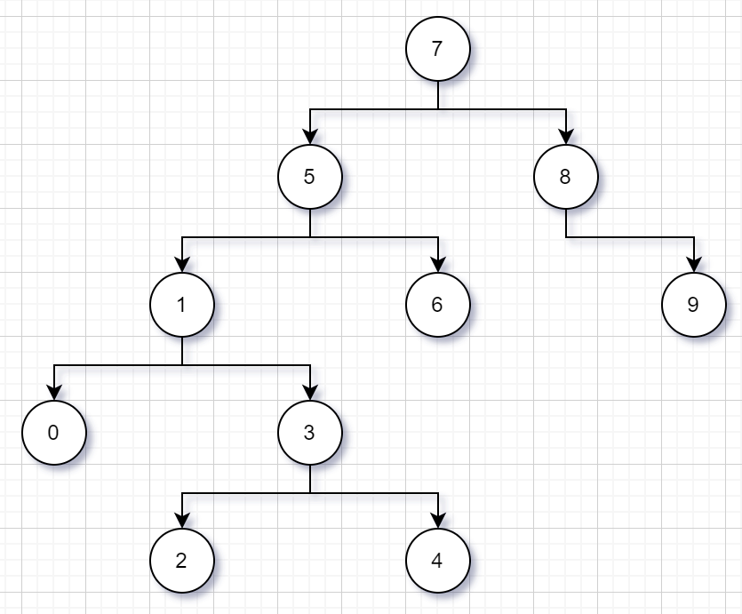

# Veri Yapıları ve Algoritmalar- Proje 3
## Soru
**[7, 5, 1, 8, 3, 6, 0, 9, 4, 2] dizisinin Binary-Search-Tree aşamalarını yazınız.**
5<7 olduğundan beş yedinin soluna yazılır:

7>5>1 olduğundan bir beşin soluna yazılır:

8>7 olduğundan sekiz yedinin sağına yazılır:

7>5>3>1 olduğundan üç birin sağına yazılır:

7>6>5 ve  olduğundan altı beşin sağına yazılır:

7>5>1>0 olduğundan sıfır birin soluna yazılır:

9>8>7 olduğundan dokuz sekizin sağına yazılır:

7>5>4>3 olduğundan dört üçün sağına yazılır:

7>5>3>2 olduğundan iki üçün soluna yazılır:
