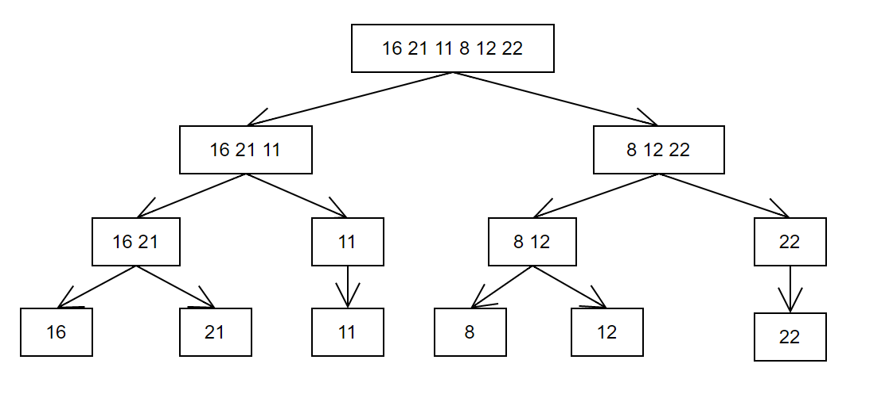
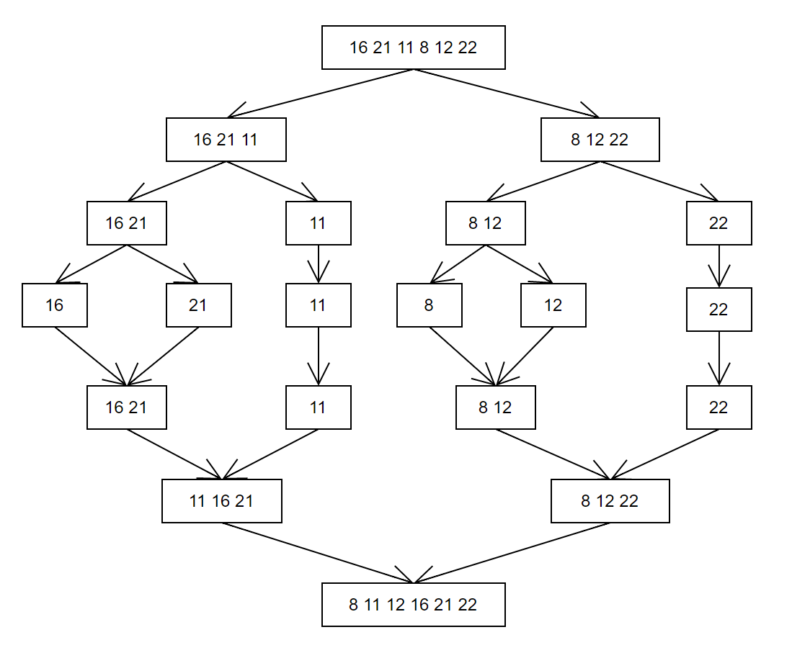

# Veri Yapıları ve Algoritmalar- Proje 2
## Soru
**[16,21,11,8,12,22] -> Merge Sort
Yukarı verilen dizinin sort türüne göre aşamalarını yazınız.**
Merge sort yaparken her eleman yalnız kalana kadar diziyi ikiye bölüyorduk;

Daha sonra küçükten büyüğe doğru sıralayarak birleştiriyorduk 

Böylece sıralı diziyi elde etmiş oluyorduk.
**Big-O gösterimini yazınız.**
Merge sort için tüm durumlarda Big-o notasyonumuz O(nlogn)'di (logaritma 2 tabanında).